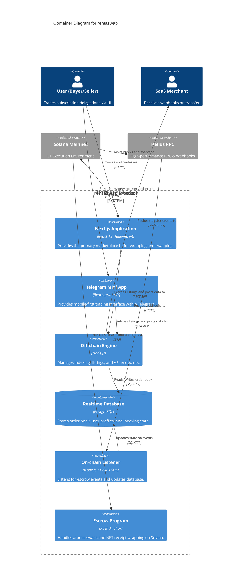

# C4 Container Level: rentaswap System Architecture

## Purpose
This document outlines the high-level architecture and system deployment for rentaswap, the secondary market for Solana subscriptions. It describes how the frontend, off-chain backend, on-chain programs, and external services interact to facilitate atomic subscription swaps.

## Container Diagram

## Containers

### 1. Next.js Application
- **Type**: Web Application
- **Technology**: Next.js 16, React 19, Tailwind v4
- **Deployment**: Coolify / Cloudflare
- **Description**: The primary user interface. Handles wallet connection, marketplace filtering, and constructing the transactions that get sent to the Solana network.

### 2. Telegram Mini App
- **Type**: Web Application (Embedded)
- **Technology**: React, grammY
- **Deployment**: Coolify / Cloudflare
- **Description**: A streamlined version of the web app optimized for Telegram, allowing users to trade seamlessly within their chat environments.

### 3. Off-chain Engine
- **Type**: API Server
- **Technology**: Node.js, Express
- **Deployment**: Coolify (Dockerized)
- **Description**: Serves REST endpoints for querying the off-chain order book (e.g., `GET /api/listings`). Minimizes RPC calls by serving cached, indexed data.

### 4. Realtime Database
- **Type**: Database
- **Technology**: PostgreSQL
- **Deployment**: Managed DB
- **Description**: Stores listings, user profiles (tier levels, total saved), merchant configurations, and protocol statistics. 

### 5. On-chain Listener
- **Type**: Background Worker
- **Technology**: Node.js, Helius SDK
- **Deployment**: Coolify (Dockerized)
- **Description**: Subscribes to Helius webhooks to detect successful escrow deposits, cancellations, and atomic swaps. Updates the PostgreSQL database in real-time to reflect the on-chain state.

### 6. Escrow Program
- **Type**: Smart Contract
- **Technology**: Rust (Anchor framework), SPL Token-2022
- **Deployment**: Solana Mainnet (BPF loader)
- **Description**: The core trustless primitive. Wraps subscription delegations into NFT receipts, locks them in a PDA, and executes the atomic swap (USDC for NFT) when conditions are met.

## Interfaces

### Off-chain API
- **Protocol**: REST / JSON over HTTPS
- **Endpoints**:
  - `GET /api/listings`: Retrieve active listings, supports sorting and filtering.
  - `POST /api/sell`: Prepares the metadata and index for a new listing (transaction still happens on-chain).
  - `GET /api/portfolio/:wallet`: Returns owned and listed subscriptions, plus USDC saved.
  - `GET /api/stats`: Returns protocol GMV, transfers, and token burn totals.

### Merchant Webhook
- **Protocol**: HTTPS POST
- **Description**: Fires when a subscription changes hands. Allows merchants to update their internal databases to grant access to the new buyer (the new NFT holder).

## Infrastructure & Scaling
- **Hosting**: Coolify handles the deployment of Node.js containers and Next.js applications, providing easy continuous delivery from GitHub.
- **RPC**: Helius provides enterprise-grade RPC and webhooks, essential for maintaining sub-second synchronization between the on-chain state and the off-chain order book.
- **Scaling**: The Off-chain Engine can scale horizontally behind a load balancer. The Realtime Database is vertically scaled initially, with read replicas added as marketplace read volume (filtering/sorting) increases.
